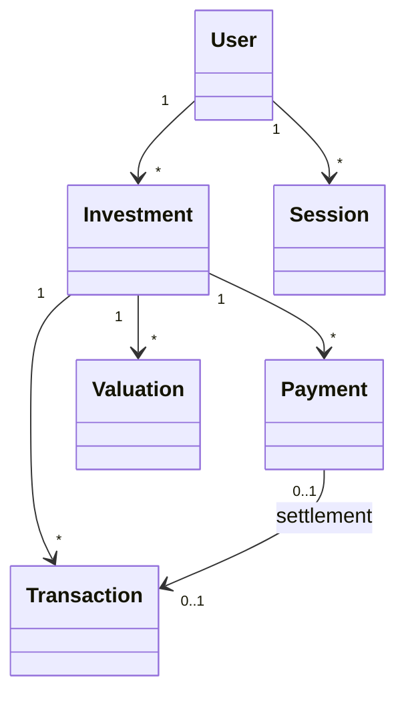
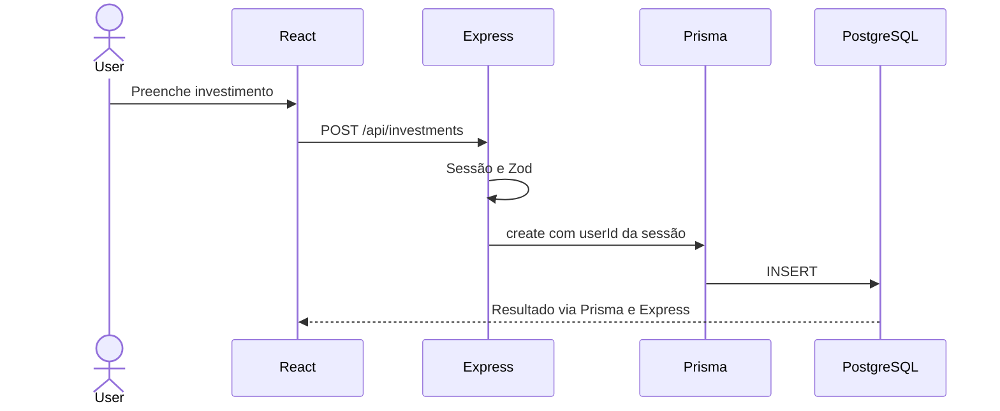
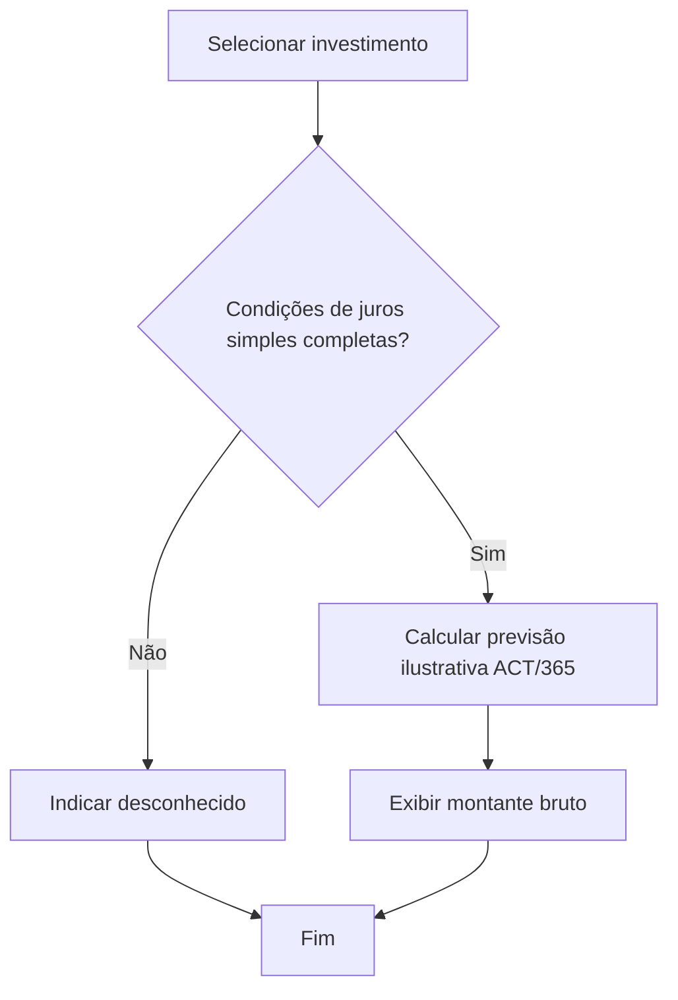
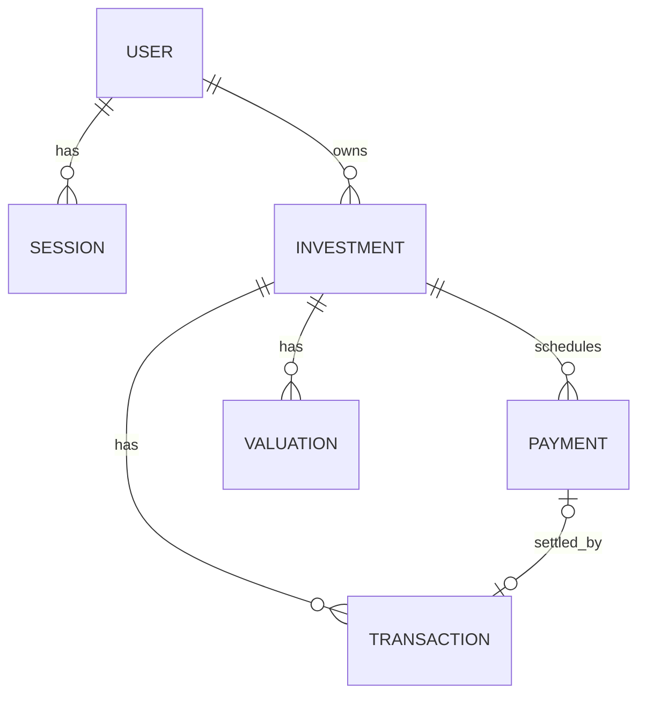

# Modelos (Mermaid)

```mermaid
classDiagram
User "1" --> "*" Investment
User "1" --> "*" Session
Investment "1" --> "*" Transaction
Investment "1" --> "*" Payment
Investment "1" --> "*" Valuation
Payment "0..1" --> "0..1" Transaction : settlement
```

```mermaid
sequenceDiagram
actor User
participant React
participant Express
participant Prisma
participant PostgreSQL
User->>React: Preenche investimento
React->>Express: POST /api/investments
Express->>Express: Sessão e Zod
Express->>Prisma: create com userId da sessão
Prisma->>PostgreSQL: INSERT
PostgreSQL-->>React: Resultado via Prisma e Express
```

```mermaid
flowchart TD
A[Selecionar investimento] --> B{Condições de juros simples completas?}
B -- Sim --> C[Calcular previsão ilustrativa ACT/365]
B -- Não --> D[Indicar desconhecido]
C --> E[Exibir montante bruto]
D --> F[Fim]
E --> F
```

```mermaid
erDiagram
USER ||--o{ SESSION : has
USER ||--o{ INVESTMENT : owns
INVESTMENT ||--o{ TRANSACTION : has
INVESTMENT ||--o{ PAYMENT : schedules
INVESTMENT ||--o{ VALUATION : has
PAYMENT o|--o| TRANSACTION : settled_by
```
